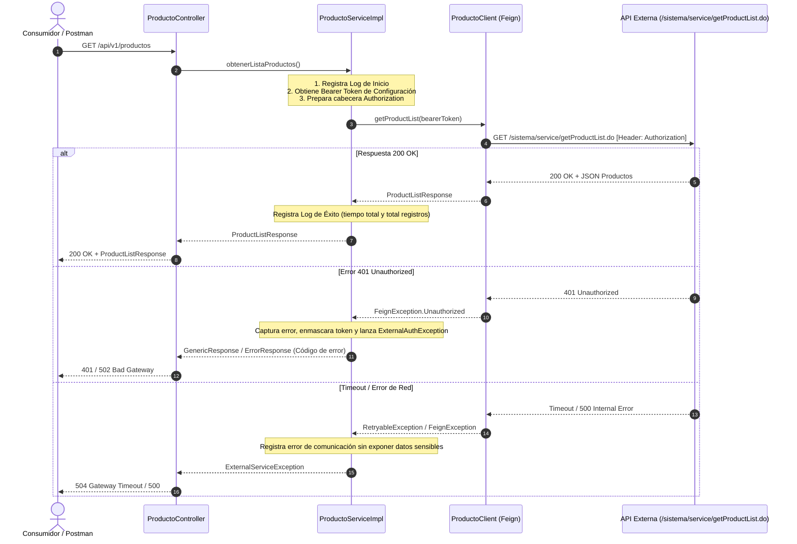

# 📘 Guía de Integración: Consumo de Servicio Externo de Productos

Esta guía técnica detalla, paso a paso y de manera desglosada, la implementación para integrar el nuevo endpoint externo `GET /sistema/service/getProductList.do` con autenticación **Bearer Token**, respetando la arquitectura en capas, patrones de diseño y estándares de calidad (Clean Code) existentes en el proyecto.

---

## 📋 Índice
1. [Resumen y Arquitectura de la Solución](#1-resumen-y-arquitectura-de-la-solución)
2. [Análisis del Proyecto y Hallazgos Previos](#2-análisis-del-proyecto-y-hallazgos-previos)
3. [Configuración de Propiedades (`application.properties`)](#3-configuración-de-propiedades-applicationproperties)
4. [Definición de DTOs y Modelos de Datos](#4-definición-de-dtos-y-modelos-de-datos)
5. [Manejo de Errores y Excepciones de Integración](#5-manejo-de-errores-y-excepciones-de-integración)
6. [Capa de Integración / Cliente Feign](#6-capa-de-integración--cliente-feign)
7. [Capa de Servicio de Negocio](#7-capa-de-servicio-de-negocio)
8. [Capa de Controlador REST](#8-capa-de-controlador-rest)
9. [Pruebas Unitarias con JUnit 5 y Mockito](#9-pruebas-unitarias-con-junit-5-y-mockito)
10. [Buenas Prácticas de Registro, Monitoreo y Seguridad](#10-buenas-prácticas-de-registro-monitoreo-y-seguridad)
11. [Decisiones Técnicas y Justificación](#11-decisiones-técnicas-y-justificación)

---

## 1. Resumen y Arquitectura de la Solución

### Diagrama de Flujo de la Petición


---

## 2. Análisis del Proyecto y Hallazgos Previos

Durante la inspección de la estructura se identificaron los siguientes aspectos clave:
- **Tecnologías base**: Spring Boot 3.3.6, Java 17, Gradle, Spring Cloud OpenFeign 4.1.4, MapStruct 1.6.3, Lombok 1.18.26.
- **Patrón de clientes**: La aplicación ya utiliza **Spring Cloud OpenFeign** (`@EnableFeignClients` en `App.java` y `GestoPagoAuthClient.java`). Mantendremos este estándar para el nuevo cliente.
- **Manejo de modelos**: Existe una jerarquía basada en `GenericResponse` (con campos `codigo` y `mensaje`).
- **Observación sobre inconsistencias preexistentes**: 
  > Se detectó que el archivo `application.properties` está vacío y existen discrepancias menores en clases existentes (ej. mayúsculas en atributos de entidades, métodos con nombres duplicados en controladores). Siguiendo las instrucciones, **no alteraremos el código preexistente con errores intencionales**, sino que nos enfocaremos exclusivamente en construir la integración de forma limpia, desacoplada y robusta.

---

## 3. Configuración de Propiedades (`application.properties`)

### Archivo: `src/main/resources/application.properties`
Siguiendo la convención del proyecto (`gestopago.*`), definimos la URL base, el endpoint específico, el token de autenticación y los límites de tiempo de espera (timeouts):

```properties
# ===================================================================
# CONFIGURACIÓN DEL SERVICIO EXTERNO: GESTOPAGO PRODUCTOS
# ===================================================================
# URL base del servicio externo
gestopago.service.url=${GESTOPAGO_SERVICE_URL:https://api.gestopago.com}

# Endpoint para la consulta de la lista de productos
gestopago.service.endpoints.get-product-list=/sistema/service/getProductList.do

# Token de autenticación Bearer (obtenido de variable de entorno o configuración)
gestopago.service.auth.token=${GESTOPAGO_AUTH_TOKEN:eyJhbGciOiJIUzI1NiIsInR5cCI6IkpXVCJ9.dummy_token_example}

# Tiempos de espera para el cliente Feign (en milisegundos)
feign.client.config.gestoPagoProductoClient.connectTimeout=5000
feign.client.config.gestoPagoProductoClient.readTimeout=10000
feign.client.config.gestoPagoProductoClient.loggerLevel=basic
```

> **Nota de Seguridad**: El token no debe estar hardcodeado en el código Java. En `application.properties` se utiliza la sintaxis `${GESTOPAGO_AUTH_TOKEN:...}` para permitir inyectarlo mediante variables de entorno en producción.

---

## 4. Definición de DTOs y Modelos de Datos

Creamos los modelos para mapear tanto el producto individual como la lista de respuesta del servicio externo, extendiendo `GenericResponse` para conservar la uniformidad de las respuestas de la aplicación.

### 4.1 DTO de Producto
**Archivo:** `src/main/java/com/proyecto/servicios/model/gestopago/ProductoDto.java`
```java
package com.proyecto.servicios.model.gestopago;

import com.fasterxml.jackson.annotation.JsonIgnoreProperties;
import com.fasterxml.jackson.annotation.JsonProperty;
import lombok.AllArgsConstructor;
import lombok.Builder;
import lombok.Data;
import lombok.NoArgsConstructor;

import java.math.BigDecimal;

@Data
@Builder
@NoArgsConstructor
@AllArgsConstructor
@JsonIgnoreProperties(ignoreUnknown = true)
public class ProductoDto {

    @JsonProperty("idProducto")
    private Long idProducto;

    @JsonProperty("codigo")
    private String codigo;

    @JsonProperty("descripcion")
    private String descripcion;

    @JsonProperty("precio")
    private BigDecimal precio;

    @JsonProperty("categoria")
    private String categoria;

    @JsonProperty("activo")
    private Boolean activo;
}
```

### 4.2 DTO de Respuesta de Lista de Productos
**Archivo:** `src/main/java/com/proyecto/servicios/model/gestopago/ProductListResponse.java`
```java
package com.proyecto.servicios.model.gestopago;

import com.fasterxml.jackson.annotation.JsonIgnoreProperties;
import com.fasterxml.jackson.annotation.JsonProperty;
import com.proyecto.servicios.model.GenericResponse;
import lombok.AllArgsConstructor;
import lombok.Data;
import lombok.EqualsAndHashCode;
import lombok.NoArgsConstructor;

import java.util.List;

@Data
@NoArgsConstructor
@AllArgsConstructor
@EqualsAndHashCode(callSuper = true)
@JsonIgnoreProperties(ignoreUnknown = true)
public class ProductListResponse extends GenericResponse {

    @JsonProperty("productos")
    private List<ProductoDto> productos;

    @JsonProperty("totalRegistros")
    private Integer totalRegistros;
}
```

---

## 5. Manejo de Errores y Excepciones de Integración

Para gestionar con precisión los errores de comunicación, autenticación, timeouts y respuestas no exitosas, creamos una jerarquía de excepciones dedicada.

### 5.1 Excepción Base de Integración
**Archivo:** `src/main/java/com/proyecto/servicios/exception/ExternalServiceException.java`
```java
package com.proyecto.servicios.exception;

import lombok.Getter;

@Getter
public class ExternalServiceException extends RuntimeException {

    private final int statusCode;

    public ExternalServiceException(String message, int statusCode) {
        super(message);
        this.statusCode = statusCode;
    }

    public ExternalServiceException(String message, Throwable cause, int statusCode) {
        super(message, cause);
        this.statusCode = statusCode;
    }
}
```

### 5.2 Excepción de Autenticación Externa (401 / 403)
**Archivo:** `src/main/java/com/proyecto/servicios/exception/ExternalAuthException.java`
```java
package com.proyecto.servicios.exception;

public class ExternalAuthException extends ExternalServiceException {

    public ExternalAuthException(String message) {
        super(message, 401);
    }

    public ExternalAuthException(String message, Throwable cause) {
        super(message, cause, 401);
    }
}
```

### 5.3 Excepción de Timeout de Integración (408 / 504)
**Archivo:** `src/main/java/com/proyecto/servicios/exception/ExternalTimeoutException.java`
```java
package com.proyecto.servicios.exception;

public class ExternalTimeoutException extends ExternalServiceException {

    public ExternalTimeoutException(String message) {
        super(message, 504);
    }

    public ExternalTimeoutException(String message, Throwable cause) {
        super(message, cause, 504);
    }
}
```

---

## 6. Capa de Integración / Cliente Feign

### 6.1 Decodificador de Errores Feign (ErrorDecoder)
Permite transformar los códigos de error HTTP de Feign (401, 404, 500, etc.) en nuestras excepciones de dominio.

**Archivo:** `src/main/java/com/proyecto/servicios/client/config/FeignCustomErrorDecoder.java`
```java
package com.proyecto.servicios.client.config;

import com.proyecto.servicios.exception.ExternalAuthException;
import com.proyecto.servicios.exception.ExternalServiceException;
import com.proyecto.servicios.exception.ExternalTimeoutException;
import feign.Response;
import feign.codec.ErrorDecoder;
import lombok.extern.slf4j.Slf4j;

@Slf4j
public class FeignCustomErrorDecoder implements ErrorDecoder {

    private final ErrorDecoder defaultErrorDecoder = new Default();

    @Override
    public Exception decode(String methodKey, Response response) {
        int status = response.status();
        log.error("Error en llamada Feign [{}] con HTTP Status: {}", methodKey, status);

        if (status == 401 || status == 403) {
            return new ExternalAuthException("Fallo de autenticación con el servicio externo (Status: " + status + ")");
        } else if (status == 408 || status == 504) {
            return new ExternalTimeoutException("Tiempo de espera agotado al invocar el servicio externo");
        } else if (status >= 400 && status < 500) {
            return new ExternalServiceException("Error del cliente al consumir servicio externo: HTTP " + status, status);
        } else if (status >= 500) {
            return new ExternalServiceException("Error interno en el servicio externo: HTTP " + status, status);
        }

        return defaultErrorDecoder.decode(methodKey, response);
    }
}
```

### 6.2 Configuración del Cliente Feign
**Archivo:** `src/main/java/com/proyecto/servicios/client/config/FeignClientConfiguration.java`
```java
package com.proyecto.servicios.client.config;

import feign.Request;
import feign.codec.ErrorDecoder;
import org.springframework.context.annotation.Bean;
import org.springframework.context.annotation.Configuration;

import java.util.concurrent.TimeUnit;

@Configuration
public class FeignClientConfiguration {

    @Bean
    public ErrorDecoder errorDecoder() {
        return new FeignCustomErrorDecoder();
    }

    @Bean
    public Request.Options requestOptions() {
        return new Request.Options(5000, TimeUnit.MILLISECONDS, 10000, TimeUnit.MILLISECONDS, true);
    }
}
```

### 6.3 Interfaz Cliente Feign
**Archivo:** `src/main/java/com/proyecto/servicios/client/GestoPagoProductoClient.java`
```java
package com.proyecto.servicios.client;

import com.proyecto.servicios.client.config.FeignClientConfiguration;
import com.proyecto.servicios.model.gestopago.ProductListResponse;
import org.springframework.cloud.openfeign.FeignClient;
import org.springframework.http.HttpHeaders;
import org.springframework.http.MediaType;
import org.springframework.web.bind.annotation.GetMapping;
import org.springframework.web.bind.annotation.RequestHeader;

@FeignClient(
        name = "gestoPagoProductoClient",
        url = "${gestopago.service.url}",
        configuration = FeignClientConfiguration.class
)
public interface GestoPagoProductoClient {

    @GetMapping(
            value = "${gestopago.service.endpoints.get-product-list:/sistema/service/getProductList.do}",
            consumes = MediaType.APPLICATION_JSON_VALUE,
            produces = MediaType.APPLICATION_JSON_VALUE
    )
    ProductListResponse getProductList(
            @RequestHeader(HttpHeaders.AUTHORIZATION) String authorizationHeader
    );
}
```

---

## 7. Capa de Servicio de Negocio

### 7.1 Interfaz del Servicio
**Archivo:** `src/main/java/com/proyecto/servicios/service/ProductoService.java`
```java
package com.proyecto.servicios.service;

import com.proyecto.servicios.model.gestopago.ProductListResponse;

public interface ProductoService {

    /**
     * Consulta el catálogo de productos desde el servicio externo de GestoPago.
     *
     * @return ProductListResponse con la lista de productos y metadatos de respuesta.
     */
    ProductListResponse obtenerListaProductos();
}
```

### 7.2 Implementación del Servicio
Esta clase implementa:
- Inyección de dependencias por constructor.
- Logging estructurado de inicio, tiempo de ejecución y fin.
- Enmascaramiento de tokens en logs (seguridad).
- Manejo defensivo de errores específicos.

**Archivo:** `src/main/java/com/proyecto/servicios/service/Impl/ProductoServiceImpl.java`
```java
package com.proyecto.servicios.service.Impl;

import com.proyecto.servicios.client.GestoPagoProductoClient;
import com.proyecto.servicios.exception.ExternalAuthException;
import com.proyecto.servicios.exception.ExternalServiceException;
import com.proyecto.servicios.exception.ExternalTimeoutException;
import com.proyecto.servicios.model.gestopago.ProductListResponse;
import com.proyecto.servicios.service.ProductoService;
import feign.RetryableException;
import lombok.extern.slf4j.Slf4j;
import org.springframework.beans.factory.annotation.Value;
import org.springframework.stereotype.Service;

import java.util.Collections;

@Service
@Slf4j
public class ProductoServiceImpl implements ProductoService {

    private final GestoPagoProductoClient productoClient;

    @Value("${gestopago.service.auth.token}")
    private String authToken;

    public ProductoServiceImpl(GestoPagoProductoClient productoClient) {
        this.productoClient = productoClient;
    }

    @Override
    public ProductListResponse obtenerListaProductos() {
        long startTime = System.currentTimeMillis();
        log.info("[INICIO] Invocando servicio externo: GET /sistema/service/getProductList.do");

        if (authToken == null || authToken.isBlank()) {
            log.error("Token de autenticación no configurado en 'gestopago.service.auth.token'");
            ProductListResponse errorResponse = new ProductListResponse();
            errorResponse.setCodigo(1);
            errorResponse.setMensaje("Configuración inválida: Token no presente");
            errorResponse.setProductos(Collections.emptyList());
            return errorResponse;
        }

        // Formato Bearer Token estándar
        String authHeader = authToken.startsWith("Bearer ") ? authToken : "Bearer " + authToken;
        log.debug("Cabecera de autorización configurada con token: {}", maskToken(authToken));

        try {
            ProductListResponse response = productoClient.getProductList(authHeader);

            long elapsed = System.currentTimeMillis() - startTime;
            int total = (response != null && response.getProductos() != null) ? response.getProductos().size() : 0;

            log.info("[FIN] Consulta de productos exitosa. Registros obtenidos: {}, Tiempo: {} ms", total, elapsed);

            if (response != null) {
                if (response.getCodigo() == null) response.setCodigo(0);
                if (response.getMensaje() == null) response.setMensaje("Operación exitosa");
            }
            return response;

        } catch (ExternalAuthException e) {
            log.error("[ERROR AUTH] Error de autenticación al consumir servicio de productos: {}", e.getMessage());
            return buildErrorResponse(401, "Error de autenticación con el proveedor externo");

        } catch (ExternalTimeoutException | RetryableException e) {
            log.error("[ERROR TIMEOUT] Timeout de comunicación con el servicio de productos: {}", e.getMessage());
            return buildErrorResponse(504, "Tiempo de espera agotado al consultar productos");

        } catch (ExternalServiceException e) {
            log.error("[ERROR HTTP] Error de respuesta externa: Status {}, Causa: {}", e.getStatusCode(), e.getMessage());
            return buildErrorResponse(e.getStatusCode(), "Error en servicio externo: " + e.getMessage());

        } catch (Exception e) {
            log.error("[ERROR GENERAL] Error inesperado en integración de productos: {}", e.getMessage(), e);
            return buildErrorResponse(500, "Error interno al procesar catálogo de productos");
        }
    }

    private ProductListResponse buildErrorResponse(Integer codigo, String mensaje) {
        ProductListResponse response = new ProductListResponse();
        response.setCodigo(codigo);
        response.setMensaje(mensaje);
        response.setProductos(Collections.emptyList());
        response.setTotalRegistros(0);
        return response;
    }

    private String maskToken(String token) {
        if (token == null || token.length() <= 8) return "****";
        return token.substring(0, 4) + "..." + token.substring(token.length() - 4);
    }
}
```

---

## 8. Capa de Controlador REST

**Archivo:** `src/main/java/com/proyecto/servicios/controller/ProductoController.java`
```java
package com.proyecto.servicios.controller;

import com.proyecto.servicios.model.gestopago.ProductListResponse;
import com.proyecto.servicios.service.ProductoService;
import io.swagger.v3.oas.annotations.Operation;
import io.swagger.v3.oas.annotations.responses.ApiResponse;
import io.swagger.v3.oas.annotations.tags.Tag;
import org.springframework.http.HttpStatus;
import org.springframework.http.MediaType;
import org.springframework.http.ResponseEntity;
import org.springframework.web.bind.annotation.GetMapping;
import org.springframework.web.bind.annotation.RequestMapping;
import org.springframework.web.bind.annotation.RestController;

@RestController
@RequestMapping("/productos")
@Tag(name = "Productos", description = "Endpoints para la consulta de productos externos")
public class ProductoController {

    private final ProductoService productoService;

    public ProductoController(ProductoService productoService) {
        this.productoService = productoService;
    }

    @GetMapping(produces = MediaType.APPLICATION_JSON_VALUE)
    @Operation(summary = "Obtiene la lista de productos", description = "Consulta el catálogo de productos disponible en el servicio externo")
    @ApiResponse(responseCode = "200", description = "Consulta realizada correctamente")
    public ResponseEntity<ProductListResponse> obtenerProductos() {
        ProductListResponse response = productoService.obtenerListaProductos();
        return new ResponseEntity<>(response, HttpStatus.OK);
    }
}
```

---

## 9. Pruebas Unitarias con JUnit 5 y Mockito

Creamos las pruebas unitarias para `ProductoServiceImpl`, cubriendo el flujo exitoso y todos los escenarios de error solicitados.

**Archivo:** `src/test/java/com/proyecto/servicios/service/ProductoServiceImplTest.java`
```java
package com.proyecto.servicios.service;

import com.proyecto.servicios.client.GestoPagoProductoClient;
import com.proyecto.servicios.exception.ExternalAuthException;
import com.proyecto.servicios.exception.ExternalServiceException;
import com.proyecto.servicios.exception.ExternalTimeoutException;
import com.proyecto.servicios.model.gestopago.ProductListResponse;
import com.proyecto.servicios.model.gestopago.ProductoDto;
import com.proyecto.servicios.service.Impl.ProductoServiceImpl;
import org.junit.jupiter.api.BeforeEach;
import org.junit.jupiter.api.DisplayName;
import org.junit.jupiter.api.Test;
import org.junit.jupiter.api.extension.ExtendWith;
import org.mockito.InjectMocks;
import org.mockito.Mock;
import org.mockito.junit.jupiter.MockitoExtension;
import org.springframework.test.util.ReflectionTestUtils;

import java.math.BigDecimal;
import java.util.List;

import static org.junit.jupiter.api.Assertions.*;
import static org.mockito.ArgumentMatchers.anyString;
import static org.mockito.ArgumentMatchers.eq;
import static org.mockito.Mockito.*;

@ExtendWith(MockitoExtension.class)
class ProductoServiceImplTest {

    @Mock
    private GestoPagoProductoClient productoClient;

    @InjectMocks
    private ProductoServiceImpl productoService;

    private static final String SAMPLE_TOKEN = "jwt.sample.token.12345";

    @BeforeEach
    void setUp() {
        ReflectionTestUtils.setField(productoService, "authToken", SAMPLE_TOKEN);
    }

    @Test
    @DisplayName("Debe obtener la lista de productos exitosamente")
    void testObtenerListaProductos_Exitoso() {
        // Arrange
        ProductoDto prod = ProductoDto.builder()
                .idProducto(101L)
                .codigo("PROD-001")
                .descripcion("Recarga Tiempo Aire")
                .precio(new BigDecimal("100.00"))
                .categoria("Servicios")
                .activo(true)
                .build();

        ProductListResponse mockResponse = new ProductListResponse();
        mockResponse.setCodigo(0);
        mockResponse.setMensaje("Exito");
        mockResponse.setProductos(List.of(prod));
        mockResponse.setTotalRegistros(1);

        when(productoClient.getProductList(eq("Bearer " + SAMPLE_TOKEN))).thenReturn(mockResponse);

        // Act
        ProductListResponse result = productoService.obtenerListaProductos();

        // Assert
        assertNotNull(result);
        assertEquals(0, result.getCodigo());
        assertEquals(1, result.getProductos().size());
        assertEquals("PROD-001", result.getProductos().get(0).getCodigo());
        verify(productoClient, times(1)).getProductList("Bearer " + SAMPLE_TOKEN);
    }

    @Test
    @DisplayName("Debe manejar error de autenticación 401 del servicio externo")
    void testObtenerListaProductos_ErrorAutenticacion() {
        // Arrange
        when(productoClient.getProductList(anyString()))
                .thenThrow(new ExternalAuthException("Unauthorized"));

        // Act
        ProductListResponse result = productoService.obtenerListaProductos();

        // Assert
        assertNotNull(result);
        assertEquals(401, result.getCodigo());
        assertTrue(result.getMensaje().contains("autenticación"));
        assertTrue(result.getProductos().isEmpty());
    }

    @Test
    @DisplayName("Debe manejar error de Timeout al consumir el servicio externo")
    void testObtenerListaProductos_ErrorTimeout() {
        // Arrange
        when(productoClient.getProductList(anyString()))
                .thenThrow(new ExternalTimeoutException("Read timeout"));

        // Act
        ProductListResponse result = productoService.obtenerListaProductos();

        // Assert
        assertNotNull(result);
        assertEquals(504, result.getCodigo());
        assertTrue(result.getMensaje().contains("agotado"));
    }

    @Test
    @DisplayName("Debe manejar error HTTP 500 del servicio externo")
    void testObtenerListaProductos_ErrorServicioExterno500() {
        // Arrange
        when(productoClient.getProductList(anyString()))
                .thenThrow(new ExternalServiceException("Internal Server Error", 500));

        // Act
        ProductListResponse result = productoService.obtenerListaProductos();

        // Assert
        assertNotNull(result);
        assertEquals(500, result.getCodigo());
        assertTrue(result.getProductos().isEmpty());
    }

    @Test
    @DisplayName("Debe retornar error cuando el token no está configurado")
    void testObtenerListaProductos_TokenNoConfigurado() {
        // Arrange
        ReflectionTestUtils.setField(productoService, "authToken", "");

        // Act
        ProductListResponse result = productoService.obtenerListaProductos();

        // Assert
        assertNotNull(result);
        assertEquals(1, result.getCodigo());
        assertTrue(result.getMensaje().contains("Token no presente"));
        verify(productoClient, never()).getProductList(anyString());
    }
}
```

---

## 10. Buenas Prácticas de Registro, Monitoreo y Seguridad

1. **No exponer credenciales ni tokens completos en logs**:
   - Se implementó la función auxiliar `maskToken(...)` para asegurar que en los archivos de log únicamente se impriman los primeros y últimos 4 caracteres (ej. `eyJh...ample`).
2. **Métricas de Rendimiento**:
   - Se registra el tiempo total en milisegundos (`elapsed ms`) entre el inicio y fin de la invocación HTTP.
3. **Manejo de Respuestas Nulas**:
   - Se protegen todas las respuestas con listas inmutables vacías (`Collections.emptyList()`) para evitar `NullPointerException` en clientes consumidores.

---

## 11. Decisiones Técnicas y Justificación

| Componente / Decisión | Elección | Justificación |
| :--- | :--- | :--- |
| **Cliente HTTP** | `Spring Cloud OpenFeign` | Mantiene el estándar ya utilizado en el proyecto (`GestoPagoAuthClient`), es declarativo, reduce boilerplate y se integra nativamente con Spring Boot. |
| **Gestión de Token** | `@Value` + Variable de Entorno | Permite configurar el token de forma flexible sin alterar el código fuente ni incurrir en hardcoding. |
| **Inyección de Dependencias** | Inyección por Constructor | Recomendada por Clean Code / Spring Framework para facilitar la inmutabilidad y pruebas unitarias aisladas sin levantar el contexto completo de Spring. |
| **Manejo de Errores** | `FeignCustomErrorDecoder` + `try/catch` | Separa la decodificación de códigos de estado HTTP de la lógica de negocio, traduciéndolos a excepciones tipadas de negocio. |
| **Testing** | `MockitoExtension` + `ReflectionTestUtils` | Pruebas unitarias rápidas y confiables sin depender de conectividad de red ni bases de datos activas. |
